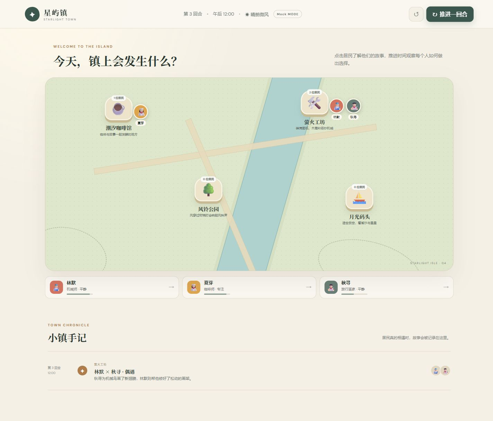
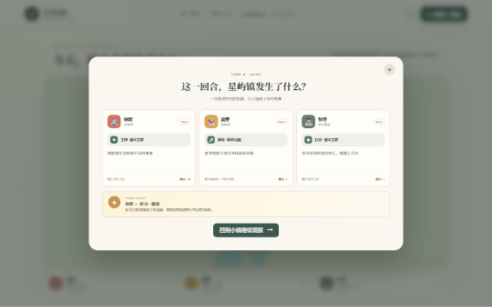
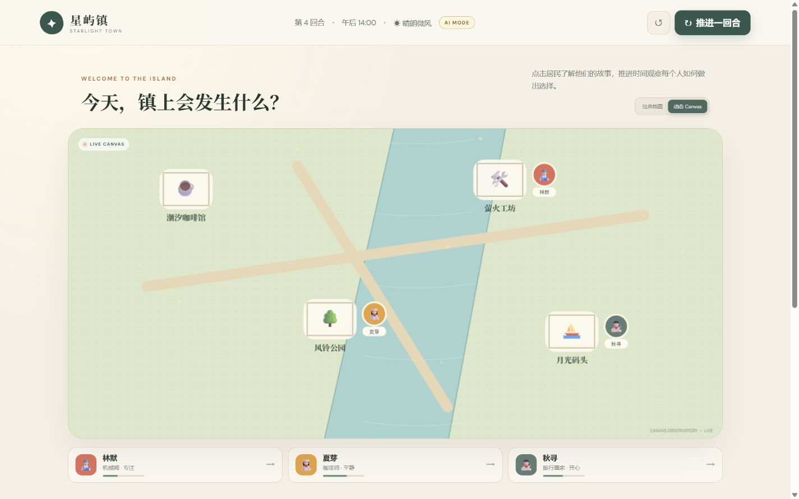

# 星屿镇 AI Town

> 候选人姓名：**请在提交前填写**  
> 仓库地址：**请在提交前填写**  
> 在线体验：未部署（本地可完整运行）  
> 技术栈：Vue 3 + TypeScript + Vite / Node.js + Express / Vitest  
> 实际投入时间：**请按实际情况填写**  
> 完成情况：经典/动态 Canvas 双地图、3 位 NPC、4 类行动、服务端自主决策、可解释回合报告、NPC 相遇事件、小镇手记、后端任务系统、差异化对话、AI/Mock 双模式、可选持久化、响应式布局、Docker、12 项自动化测试  
> 已知问题：真实 AI 模式依赖兼容 OpenAI Chat Completions 的接口；未配置 `PERSIST_WORLD=true` 时重启服务会回到初始状态



## 项目简介

星屿镇是一个可本地运行的 Web 版 AI 小镇 MVP。玩家可以观察三位居民，推进时间查看他们根据人设、精力、地点和回合做出的行动。每回合会展示逐人的行动原因、精力变化和 AI/Mock 来源；居民到达同一地点后还会产生双方专属的互动故事。

项目默认使用无密钥 Mock 模式，克隆后无需配置任何模型即可体验完整流程。配置模型密钥后，NPC 决策与对话会优先由 AI 生成；模型超时、输出不合法或服务不可用时，后台会自动降级到 Mock，主流程不会中断。

## 快速启动

环境要求：Node.js 20 或更高版本，npm 10 或更高版本。

```bash
npm install
npm run dev
```

启动后访问：

- 前端：http://localhost:5173
- 后台：http://localhost:3001
- 健康检查：http://localhost:3001/api/health

生产构建与本地运行：

```bash
npm run build
npm start
```

然后访问 http://localhost:3001。请先执行 `npm run build`，使 Express 能提供前端静态文件。

## 玩法

1. 地图展示潮汐咖啡馆、萤火工坊、风铃公园和月光码头。
2. 点击地图上的居民或底部居民卡片，查看人物性格、精力、当前行为和最近 3 条行动。
3. 点击右上角“推进一回合”，时间前进 2 小时，后台为每位 NPC 生成并执行下一步行动。
4. 在回合报告中查看每位 NPC 的动作、原因、精力变化和决策来源。
5. 连续推进回合，NPC 相遇后会在“小镇手记”留下互动故事。
6. 在居民面板底部输入一句话，查看符合人物设定的回复。
7. 切换“动态 Canvas”，可在实时绘制的河流、光点和道路场景中直接点击居民。
8. 完成“小镇委托”会在回合报告中弹出完成反馈并解锁对应徽章。
9. 使用重置按钮可恢复初始世界，方便重复演示。

### 居民设定

| 居民 | 身份 | 性格与表达方式 |
| --- | --- | --- |
| 林默 | 机械师 | 寡言、理性、认真；常用机械和拆解问题作比喻 |
| 夏芽 | 咖啡师 | 热情、好奇、健谈；回复常围绕咖啡和镇上新鲜事 |
| 秋寻 | 旅行画家 | 浪漫、敏感、随性；习惯从景色、颜色和留白出发 |

## 目录结构

```text
.
├─ server/
│  ├─ ai.ts          # 模型调用、超时与 Mock 对话降级
│  ├─ app.ts         # Express API、校验与错误处理
│  ├─ app.test.ts    # API 自动化测试
│  ├─ data.ts        # 小镇与 NPC 初始化数据
│  ├─ decision.ts    # 决策校验、Mock 策略、状态更新与相遇事件
│  ├─ decision.test.ts # 决策安全和模拟规则测试
│  ├─ quest.ts       # 服务端任务进度与完成判定
│  ├─ quest.test.ts  # 任务累计和只完成一次测试
│  ├─ store.ts       # 可选 JSON 原子持久化
│  └─ types.ts       # 后端领域类型
├─ src/
│  ├─ components/    # DOM/Canvas 地图、任务、报告和 NPC 详情组件
│  ├─ api.ts         # 前端请求与统一错误处理
│  ├─ App.vue        # 页面状态与交互编排
│  └─ style.css      # 场景、面板与响应式样式
├─ docs/demo/        # 验收流程截图
├─ Dockerfile
├─ compose.yaml
├─ .env.example
└─ README.md
```

## API

| 方法 | 路径 | 说明 |
| --- | --- | --- |
| GET | `/api/health` | 服务状态与当前 AI/Mock 模式 |
| GET | `/api/world` | 小镇、地点、NPC 当前状态 |
| POST | `/api/world/tick` | 推进回合，为全部 NPC 决策并执行行动 |
| POST | `/api/world/reset` | 重置世界，便于重复演示 |
| GET | `/api/npcs/:id` | NPC 详情及最近 3 条行动 |
| POST | `/api/npcs/:id/chat` | 与指定 NPC 对话，Body: `{ "message": "..." }` |

错误响应格式统一为：

```json
{ "error": "INVALID_MESSAGE", "message": "请输入想说的话" }
```

聊天内容必须是非空字符串且不超过 200 字；不存在的 NPC 返回 404；畸形 JSON 返回 400；并发推进返回 409；未知接口返回 404；未处理异常返回不泄露内部细节的 500 响应。

## NPC 决策流程

```text
推进回合
  → 汇总 NPC 人设、精力、当前位置、回合和允许地点
  → 有密钥：请求 AI 输出结构化 JSON
  → 无密钥/超时/解析失败：生成 Mock 决策
  → 校验 action 白名单、target 地点白名单、reason 类型与长度
  → 校验移动必须换地点、非移动必须留在当前地点、原因与目标一致
  → 非法结果再次降级为 Mock
  → 后台更新位置、精力、心情、当前行为与行动记录
  → 检测同地点居民并生成相遇事件与回合报告
  → 返回完整世界状态供前端刷新
```

系统只接受 `move`、`work`、`rest`、`socialize` 四种行为。模型文本不会被当作代码或系统命令执行；密钥仅在后台读取。

Mock 决策不是随机占位：低精力时优先休息，其余行动由当前回合和 NPC 序号稳定轮换，因此没有密钥时也能可靠演示和测试。

## AI 与 Mock 配置

默认无需创建 `.env`。如需启用真实模型：

```bash
copy .env.example .env
```

在 `.env` 中填写：

```dotenv
AI_API_KEY=your_key_here
AI_BASE_URL=https://api.openai.com/v1
AI_MODEL=gpt-4o-mini
AI_TIMEOUT_MS=15000
```

不要将 `.env` 或真实密钥提交到仓库。页面顶栏会显示当前的 `AI MODE` 或 `Mock MODE`。

设置 `PERSIST_WORLD=true` 后，世界状态会通过临时文件写入和原子重命名保存到 `.data/world.json`。默认关闭，方便评审每次从相同状态开始。

## 测试与质量检查

```bash
npm run check
```

该命令依次执行 Vue/TypeScript 类型检查、Vitest 测试和生产构建。当前 12 项测试覆盖：回合推进与决策来源、聊天参数校验与人设回复、未知 NPC、畸形 JSON、世界重置、恶意 AI 输出降级、动作与目标语义一致性、Mock 非原地移动、精力与记录边界、NPC 相遇事件、回合任务累计、相遇任务完成与防重复奖励。

Docker 启动：

```bash
docker compose up --build
```

访问 http://localhost:3001。Compose 默认打开持久化并使用命名卷保存数据。

## 部署到 Render

仓库内的 `render.yaml` 已包含构建、启动、健康检查和 DeepSeek 配置。将项目推送到 GitHub 后，在 Render 选择 **New → Blueprint**，连接该仓库并部署。创建过程中只需填写秘密变量 `AI_API_KEY`，不要把密钥提交进 Git。

部署成功后，Render 会提供形如 `https://xingyu-ai-town.onrender.com` 的在线体验地址。免费实例闲置后会休眠，首次访问可能需要等待约一分钟；免费实例没有持久磁盘，因此服务重启后小镇进度会恢复初始状态，适合作业演示但不用于正式生产。

## 技术取舍

- 同时提供语义化 DOM 地图与高分屏 Canvas 动态地图；Canvas 使用隐藏的可访问按钮保留键盘与读屏入口。
- 使用“规则控制边界、AI 负责受限选择与人设表达”，模型不能直接操作系统状态。
- Mock 是确定性的，便于无密钥演示和自动化测试。
- 默认内存状态保证零配置启动，同时提供可选 JSON 持久化作为加分能力。
- 小镇委托完全由后端世界状态累计和判定，刷新页面不会丢失，前端只负责展示进度与奖励。
- 显式回合报告让评审可以直接看到动作、原因、来源和状态差异。

## AI 工具使用说明

本项目使用 AI 编程工具辅助完成：需求拆解、前后端脚手架、类型定义、UI 样式草案、测试用例草案与文档整理。人工负责数据模型和接口边界确认、模型输出安全校验、Mock 降级策略、状态更新规则、视觉验收及端到端操作验证。

### 一个人工修正案例

AI 初稿倾向于直接信任模型返回的 `action` 和 `target`。人工审查后将决策拆成 `validateDecision` 与 `applyDecision` 两步：先验证行为白名单、地点是否真实存在、原因是否为非空字符串并限制长度，任何异常都回落到 `mockDecision`，再执行状态更新。这样避免模型幻觉产生不存在地点或未知动作，也确保 AI 服务失败时仍能推进回合。

另一个环境层面的修正是：Windows 当前账户无法创建 pnpm 项目缓存符号链接，因此实际验收改用 npm 安装；项目代码与包管理器无绑定。

## 演示材料

- `docs/demo/town-excellent.png`：增强版小镇主页、4 个地点、居民位置和相遇手记。
- `docs/demo/turn-report.png`：逐 NPC 的可解释决策、状态差异和相遇事件。
- `docs/demo/npc-chat.png`：推进到第 2 回合后的 NPC 行动记录和玩家对话。
- `docs/demo/bonus-canvas-desktop.png`：动态 Canvas 地图与实时居民位置。
- `docs/demo/bonus-quest-mobile.png`：移动端任务完成反馈。





## 可继续扩展

如果有更多时间，可加入 SQLite、长期记忆、Canvas 路径动画和线上部署。本版本优先保证核心闭环稳定、可解释、容易现场修改，并用 Canvas 观察模式、服务端任务系统与可选持久化覆盖加分方向。
